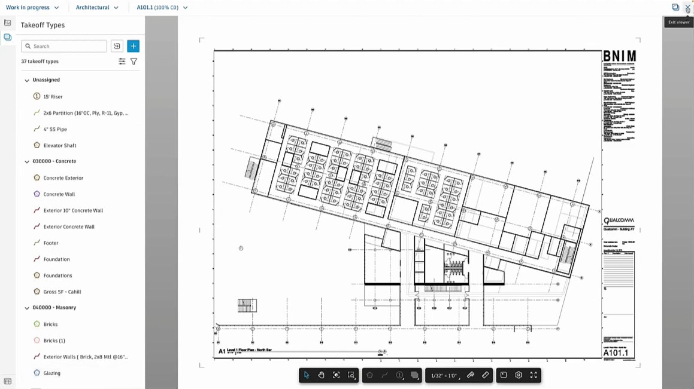
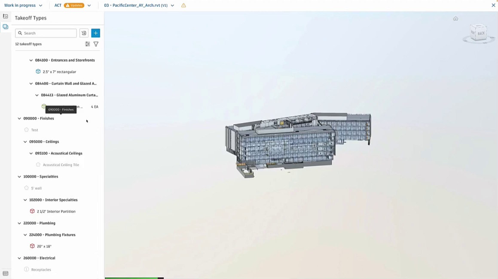

_Core technologies -- React, Node.js, Revit, ADSK Construction Cloud/BIM360, ADSK Viewer/Forge/LMV_

I worked in the team behind Autodesk Takeoff from Fall 2022 to Winter 2024, and it was a great experience. A lot of high-calibre engineering going on there, due to the demanding nature of their clients' work. Takeoff is used by construction estimation professionals, usually in the pre-construction phase as bids and contracts are being prepared.

Takeoff works with 2D sheets and 3D models. Users can make **linear**, **area**, **count** and **BIM** takeoffs, and can define custom calculations that are derived from those measurements.

It was also neat to use my Revit models from school and testing the app with them.

My main contributions to the app were in front-end housekeeping and improving the 3D model browser. It was a tree-like view of all the elements in a 3D model, with various filtering and searching options. Very handy feature for power users.
