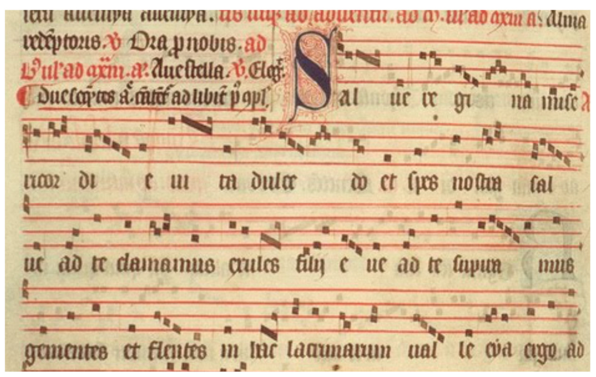
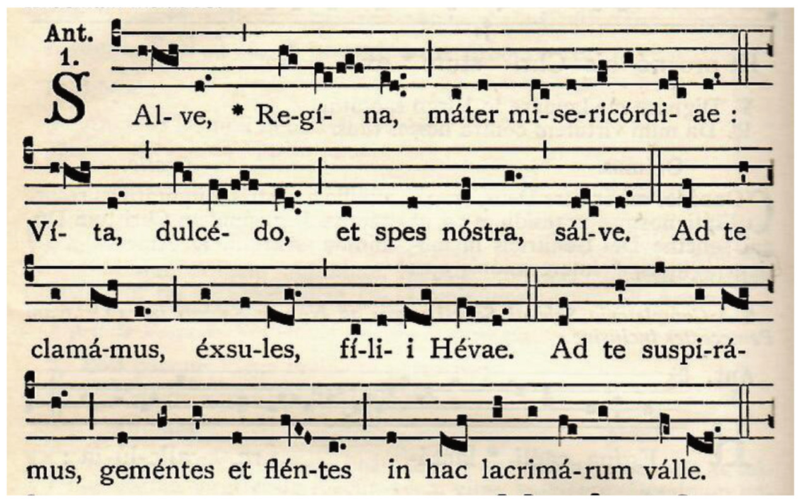
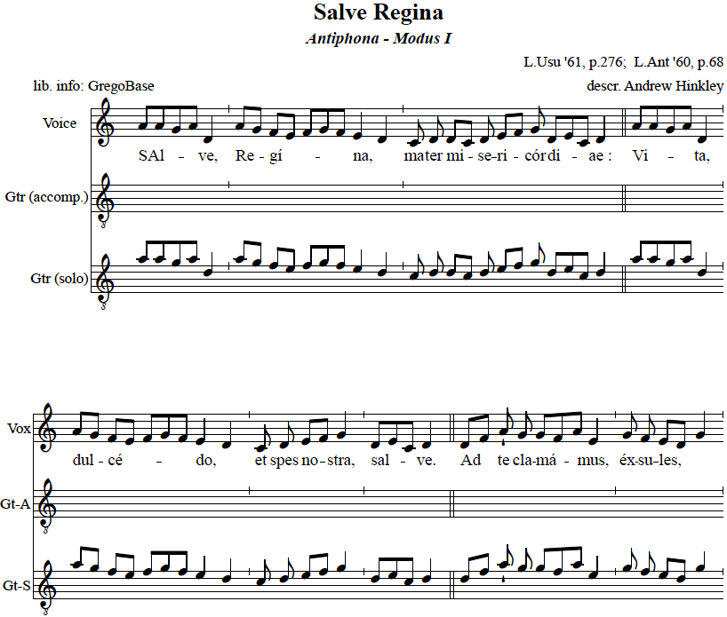
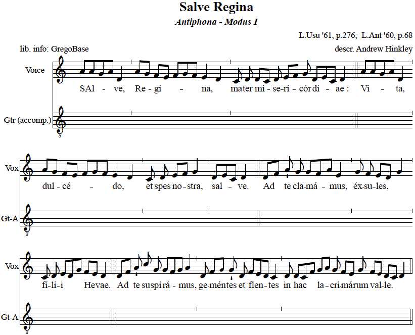
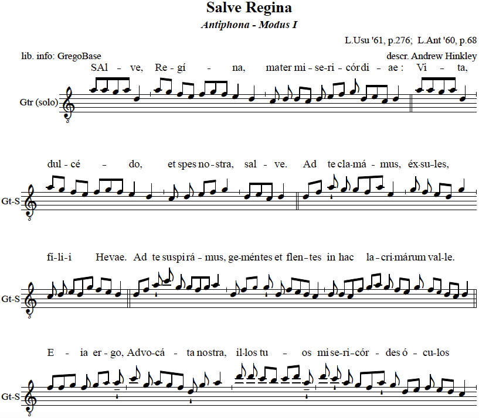

_Core technologies -- Python, LilyPond (LY), GABC_

Editoris Melicorum is a digital music typesetting toolkit for music ministries in Catholic parishes. The toolkit helps build musical arrangements around traditional hymns in Gregorian notation. As well as laying them out into documents, both for the congregation and the choir/musicians.

| Item | Link |
| --- | --- |
| GitHub repository | https://github.com/guild-st-isidore-TO/editorismelicorum |
| PDF info handout | https://github.com/guild-st-isidore-TO/editorismelicorum/blob/main/static/emel-antiphons.pdf |
| Score example (complete guitar) | https://github.com/guild-st-isidore-TO/editorismelicorum/blob/main/static/marian-antiphons-simple-all-v0.8.pdf |
| Score example (guitar accomp.) | https://github.com/guild-st-isidore-TO/editorismelicorum/blob/main/static/marian-antiphons-simple-accomp-v0.8.pdf |
| Score example (guitar solo) | https://github.com/guild-st-isidore-TO/editorismelicorum/blob/main/static/marian-antiphons-simple-solo-v0.8.pdf |

## Background & Inspiration

Two main events got the ball rolling for this project:

### April 2023 – Holy Week pilgrimage

- 10-day pilgrimage to Vatican City.
- Two masses celebrated by **Pope Francis**: **Good Friday** (my b-day that year), **Easter Sunday**.


### Oct 2024 – Joined choir @ St. Vincent de Paul

- SVP (along with Holy Family Parish) is served by traditionalist clergy (Oratory of Toronto).
- Music ministry **sings Latin very often** in masses.

## Salve Regina (Solemn Tone) throughout history

The "Salve Regina" _(Hail, Holy Queen)_ is a hymn devoted to the Blessed Virgin Mary, mother of Jesus Christ. The "Solemn" form of this hymn has been consistently sung for centuries, traditionally at the end of night prayers (Compline) on many Sundays and Marian Solemnities.

### 1333 - 1345

**The Poissy Antiphonal** -- A certified Dominican antiphonal of 428 folios from Poissy, written 1335-1345, with a complete annual cycle of chants for the Divine Office (Temporal, Sanctoral and Commons) and a hymnal. The manuscript also contains rules for copying chant and 23 historiated initials: it is in the State Libary of Victoria  
_SOURCE: Wikipedia / Wikimedia Commons_



### 1900 - 1954

Quelle: **Liber usualis** missae et officii pro dominicis et festis cum cantu Gregoriano ex editione Vaticana adamussim excerpto a Solesmensibus Monachis. Desclée, Paris/Tournai 1954, S. 276  
_SOURCE: Wikipedia / Wikimedia Commons_



### 2017

The Parish Book of Chant, Expanded Second Edition (Revised Version 2017)  
_SOURCE: Church Music Association of America_  


## Editoris Melicorum (EMEL) v. 0.0.7

This version of EMEL can produce three versions of sheets from hymns in GregoBase:

### VERSIO CUNCTA CITHARŒDI  

**Complete Guitar Version**  
Three parts, with two staves below the vocal line, both written in Treble clef (octave below). The first is the accompaniment line for the vocals. And the second is a solo guitar line, for interludes/intros/outros.



### VERSIO CITHARŒDI AUXILIARIS  

**Guitar Accompanist Version**  
Two parts, one for the vocal line and one for the guitar accompaniment. Lyrics are shown between both staves.



### VERSIO CITHARŒDI PRIMI   

**Guitar Soloist Version**  
One solo guitar part, for interludes/intros/outros. Lyrics are shown above the solo part.



## GABC notation to LY notation

GABC is a simple notation based exclusively on ASCII characters that enables the user to describe Gregorian chant scores. The name gabc was given in reference to the ABC notation for modern music. The gabc notation was developed by a monk of the Abbey of Sainte Madeleine du Barroux and has been improved by Élie Roux and by other monks of the same abbey to produce the best possible notation. More info available at:  
https://gregorio-project.github.io/gabc/

Under the hood, EMEL converts GABC data (which describes Gregorian Notation) to LY data (which describes modern Standard Musical Notation). This is done primarily through Python scripts and related tech. More info available at:  
https://lilypond.org/  
https://github.com/guild-st-isidore-TO/editorismelicorum

### GABC source code

```gabc
name:Salve Regina;
office-part:Antiphona;
mode:1;
book:The Liber Usualis, 1961, p. 276 & Liber antiphonarius, 1960, p. 68;
transcriber:Andrew Hinkley;
%%
(c4) SAl(hhgh)ve,(d.) *(,) Re(hg)gí(fe/fgf)na,(e[ll:1]d..) (;) ma(c)ter(d) mi(dc)se(d)ri(ef)cór(g)di(dec)ae :(d.) (::) Vi(hhgh)ta,(d.) (,) dul(hg)cé(fe/fgf)do,(e[ll:1]d..) (;) et(c) spes(d) no(ef)stra,(g.) (,) sal(dec)ve.(d.) (::) Ad(df) te(h') cla(g)má(gfh)mus,(e.) (;) éx(g)su(f)les,(edg.) (,) fí(c)li(d)i(edg) He(fe)vae.(d.) (::) Ad(df) te(h') su(j)spi(g)rá(gfg)mus,(h.) (;) ge(d)mén(fg~)tes(g') et(d) flen(fvED)tes(c.) (;) in(d) hac(dcf) la(gh)cri(g)má(fe)rum(g) val(fe~)le.(dcd.) (::) E(ffg){ia}(f) er(gh~)go,(h'_) (,) Ad(j)vo(g)cá(hvGF)ta(d') no(g)stra,(h.) (;) il(k)los(k) tu(ji/jk)os(h'_) (,) mi(k)se(j')ri(h)cór(gfh')des(g) ó(de)cu(f)los(evDC.) (;) ad(cd) nos(f) con(gf~)vér(dcd)te.(d.) (::) Et(d) Je(a)sum,(c_[ll:1]d) (,) be(d)ne(de)dí(e[ll:1]dd)ctum(c') fru(g)ctum(f) ven(e[ll:1]d~)tris(g) tu(fe)i,(dcd.) (;) no(ixdh'!iv)bis(h.) (,) post(hvGF) hoc(g') ex(d)sí(f)li(fe)um(dc__) (,) os(efe)tén(d.)de.(d.) (::) O(hhg/h!iwj) cle(ivHG)mens :(h.) (::) O(g.h!iwjji) pi(hg)a :(gh..) (::) O(hd__fvEDC'd) (,) (de!fg) dul(gf~)cis(g_[uh:l]h) *() Vir(d)go(c') Ma(d)rí(dgff)a.(e[ll:1]d..) (::)
```

### GABC converted to LilyPond (LY) source code

Using GABCTK

```lilypond
\version "2.18"

\header {
  title = "Salve Regina"
  tagline = ""
  composer = ""
}

\paper {
 #(include-special-characters)
}

MusiqueTheme = {
 \key c\major
%1
 a'8[( a'8 g'8 a'8)] d'4
%2
 \bar "'"
%3
 a'8[( g'8)] f'8[( e'8] f'8[ g'8 f'8)] e'4( d'4)
%4
 \bar "'"
%5
 c'8 d'8
%6
 d'8[( c'8)] d'8 e'8[( f'8)] g'8 d'8[( e'8 c'8)] d'4
%7
 \bar "||"
%8
 a'8[( a'8 g'8 a'8)] d'4
%9
 \bar "'"
%10
 a'8[( g'8)] f'8[( e'8] f'8[ g'8 f'8)] e'4( d'4)
%11
 \bar "'"
%12
 c'8
%13
 d'8
%14
 e'8[( f'8)] g'4
%15
 \bar "'"
%16
 d'8[( e'8 c'8)] d'4
%17
 \bar "||"
%18
 d'8[( f'8)]
%19
 a'8-!
%20
 g'8 g'8[( f'8 a'8)] e'4
%21
 \bar "'"
%22
 g'8 f'8 e'8[( d'8] g'4)
%23
 \bar "'"
%24
 c'8 d'8 e'8[( d'8 g'8)]
%25
 f'8[( e'8)] d'4
%26
 \bar "||"
%27
 d'8[( f'8)]
%28
 a'8-!
%29
 c''8 g'8 g'8[( f'8 g'8)] a'4
%30
 \bar "'"
%31
 d'8 f'8[( \tiny g'8)] \normalsize g'8-!
%32
 d'8
%33
 f'8[( e'8 d'8)] c'4
%34
 \bar "'"
%35
 d'8
%36
 d'8[( c'8 f'8)]
%37
 g'8[( a'8)] g'8 f'8[( e'8)] g'8
%38
 f'8[( \tiny e'8)] \normalsize d'8[( c'8] d'4)
%39
 \bar "||"
%40
 f'8[( f'8 g'8)] f'8
%41
 g'8[( \tiny a'8)] \normalsize a'8---!
%42
 \bar "'"
%43
 c''8 g'8 a'8[( g'8 f'8)] d'8-!
%44
 g'8 a'4
%45
 \bar "'"
%46
 d''8 d''8
%47
 c''8[( b'8] c''8[ d''8)] a'8---!
%48
 \bar "'"
%49
 d''8 c''8-! a'8 g'8[( f'8 a'8)]-! g'8
%50
 d'8[( e'8)] f'8 e'8[( d'8] c'4)
%51
 \bar "'"
%52
 c'8[( d'8)]
%53
 f'8
%54
 g'8[( \tiny f'8)] \normalsize d'8[( c'8 d'8)] d'4
%55
 \bar "||"
%56
 d'8
%57
 a8 c'8[(-- d'8)]
%58
 \bar "'"
%59
 d'8 d'8[( e'8)] e'8[( d'8 d'8)] c'8-!
%60
 g'8 f'8
%61
 e'8[( \tiny d'8)] \normalsize g'8
%62
 f'8[( e'8)] d'8[( c'8] d'4)
%63
 \bar "'"
%64
 d'8[( a'8-! bes'8)] a'4
%65
 \bar "'"
%66
 a'8[( g'8 f'8)]
%67
 g'8-!
%68
 d'8 f'8 f'8[( e'8)] d'8[(-- c'8)]--
%69
 \bar "'"
%70
 e'8[( f'8 e'8)] d'4 d'4
%71
 \bar "||"
%72
 a'8[( a'8 g'8] a'8[ b'8\prall c''8)]
%73
 b'8[( a'8 g'8)] a'4
%74
 \bar "||"
%75
 g'4( a'8[ b'8\prall c''8 c''8 b'8)]
%76
 a'8[( g'8)] g'4( a'4)
%77
 \bar "||"
%78
 a'8[(-- d'8-- f'8 e'8 d'8 c'8-! d'8)]
%79
 \bar "'"
%80
 d'8[( e'8 f'8 g'8)]
%81
 g'8[( \tiny f'8)] \normalsize g'8[(-- a'8)]
%82
 d'8 c'8-!
%83
 d'8 d'8[( g'8 f'8 f'8)] e'4( d'4)
%84
 \bar "||"
}

Paroles = \lyricmode {
%1
SAl -- ve,
%2
%3
&zwj;*__Re -- gí -- na,
%4
%5
ma -- ter
%6
mi -- se -- ri -- cór -- di -- ae_:
%7
%8
Vi -- ta,
%9
%10
dul -- cé -- do,
%11
%12
et
%13
spes
%14
no -- stra,
%15
%16
sal -- ve.
%17
%18
Ad
%19
te
%20
cla -- má -- mus,
%21
%22
éx -- su -- les,
%23
%24
fí -- li -- i
%25
He -- vae.
%26
%27
Ad
%28
te
%29
su -- spi -- rá -- mus,
%30
%31
ge -- mén -- tes
%32
et
%33
flen -- tes
%34
%35
in
%36
hac
%37
la -- cri -- má -- rum
%38
val -- le.
%39
%40
E -- ia
%41
er -- go,
%42
%43
Ad -- vo -- cá -- ta
%44
no -- stra,
%45
%46
il -- los
%47
tu -- os
%48
%49
mi -- se -- ri -- cór -- des
%50
ó -- cu -- los
%51
%52
ad
%53
nos
%54
con -- vér -- te.
%55
%56
Et
%57
Je -- sum,
%58
%59
be -- ne -- dí -- ctum
%60
fru -- ctum
%61
ven -- tris
%62
tu -- i,
%63
%64
no -- bis
%65
%66
post
%67
hoc
%68
ex -- sí -- li -- um
%69
%70
os -- tén -- de.
%71
%72
O
%73
cle -- mens_:
%74
%75
O
%76
pi -- a_:
%77
%78
O
%79
%80
%81
dul -- cis
%82
&zwj;*__Vir -- go
%83
Ma -- rí -- a.
%84

}

\score{
  <<
    \new Staff <<
      \set Staff.midiInstrument = "flute"
      \set Staff.autoBeaming = ##f
      \new Voice = "theme" {
        \cadenzaOn \transpose c c{\MusiqueTheme}
      }
    >>
    \new Lyrics \lyricsto theme {
      \Paroles
    }
  >>
  \layout{
    \context {
      \Staff
      \override TimeSignature #'stencil = #point-stencil
      \override Slur #'stencil = ##f
    }
  }
  \midi{}
}
```