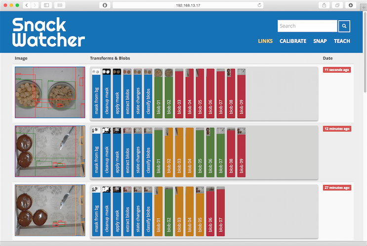
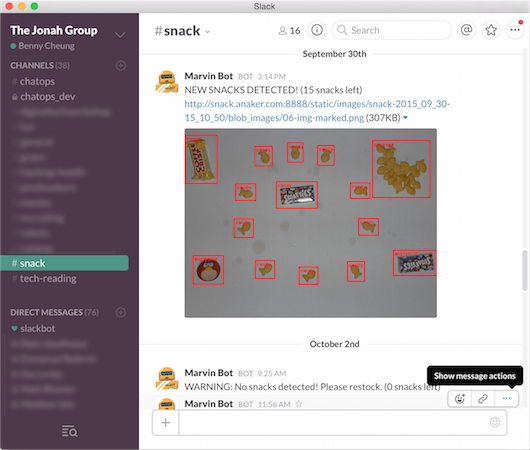

Sometime in late 2015/early 2016, I worked on a neat project while working at the Jonah Group. When we wanted to share snacks, they would place it on a _snack table_, so fellow devs can enjoy some treats. The project's premise was to install a camera over the snack table, and automatically alert our colleagues whenever a snack was deployed.

## Tools used

#### HARDWARE

- _Raspberry Pi 2_. One for development, and another for deployment
- Spare monitors, for shielding the camera from glare

#### SOFTWARE

- [_OpenCV_](http://opencv.org/) and [_SimpleCV_](http://simplecv.org/) for image recognition.
- [_Orange_](https://orange.biolab.si/) machine learning tools.
- [_Flask_](http://flask.pocoo.org/) and _Jinja_ were used for displaying data to the web.
- [_Hubot_](https://hubot.github.com/) gave our team automatic updates via Slack.

## Process

Upon joining the SnackWatcher team, I worked on the user-facing parts of the system. First, I set up a Slack bot to let our colleagues know when there are new snacks. This bot periodically checked the table status (using the handy SnackWatcher API). I also implemented a webpage using _Flask_, a Python static site generator.

## Results

It worked! Even if it was easily confused by what we put on the table, it worked!

For more details, feel free to check out the [GitHub repo](https://github.com/jonahgroup/SnackWatcher) and [blog](https://jonahgroup.github.io/SnackWatcher/) for the project.
