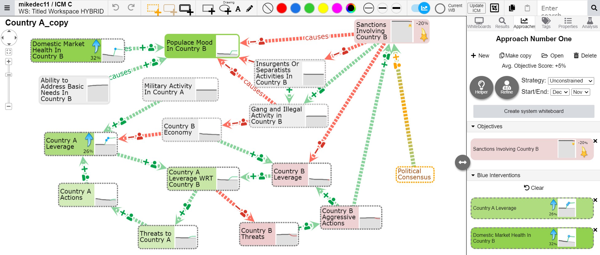
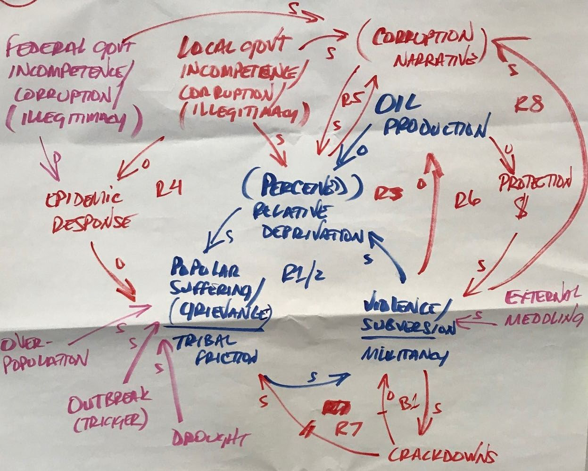
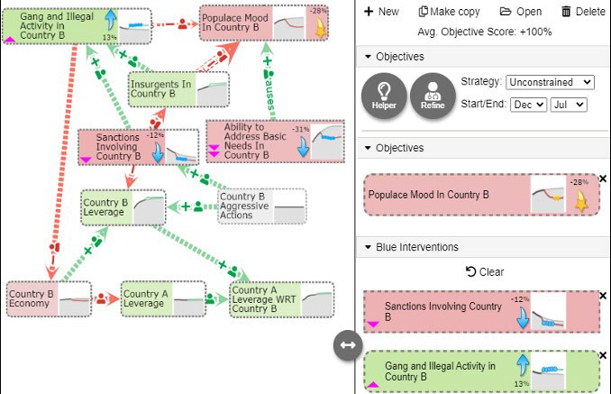
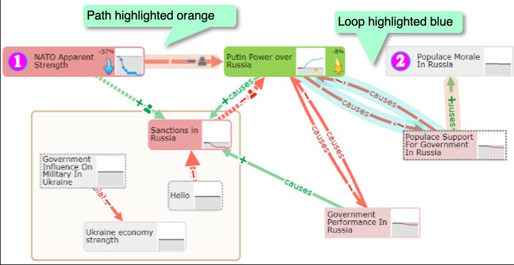
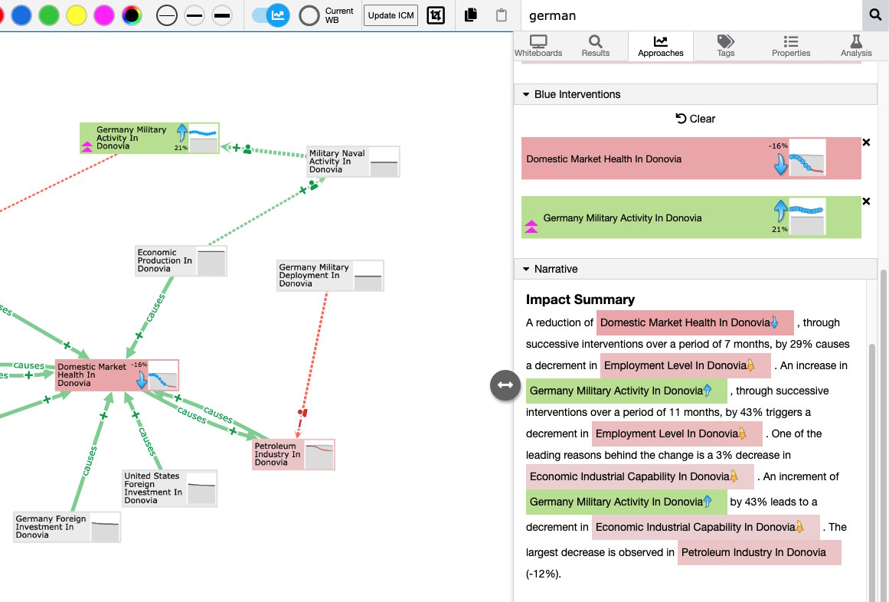

_Core technologies -- Ember.js, Cytoscape, Node.js, Express, Python, AWS_

I worked at Uncharted Software from Fall 2019 to Spring 2021, and had my first experience on a research project. CauseWorks featured a network graph that helped uncover insights in complex scenarios. CauseWorks is centred around a causal model and causality visualization through a directed graph. With causal factors (nodes) connected by causal relationships (directed edges).

For more information, check out [Uncharted's published research](https://uncharted.software/research/) or [view the paper](https://link.springer.com/article/10.1007/s42979-022-01452-y).

Without a system like CauseWorks, complex scenarios were laid out by military planners on whiteboards or large sheets of paper. Things quickly become difficult to read with this approach, and editing is very messsy.

## Analysis examples

An approach analysis is shown on the side panel. We can see defined user objectives and the system suggests potential interventions for achieving them.

The system can also find feedback loops in the causal system and display them to the user.

My main feature contribution to CauseWorks was the integration of a Narratives analysis module, built by researchers at Virginia Tech. This Python module took an approach and created a descriptive narrative of it.

