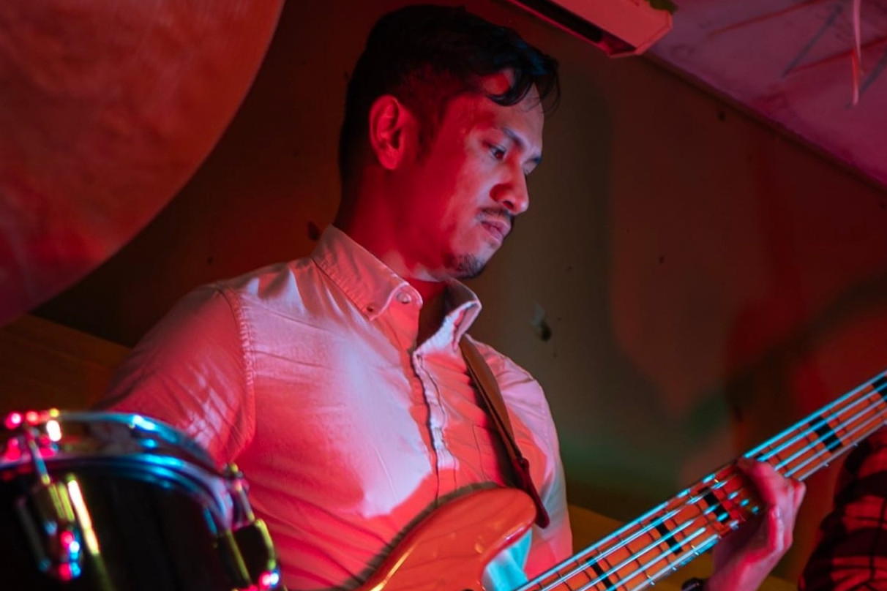

# About Me

My name's RJ and I'm a software engineer based in Toronto, Canada. Having worked in web development since 2014, I've learned how to use several technologies to tackle issues across tech stacks. As my career progressed, I developed a focus on the front-end, UI/UX, data visualization, and 3D modeling. More recently, I've worked with complex data visualizations in a research project (Uncharted Software) and 2D/3D construction estimation (Autodesk Construction Solutions).

Nowdays, I'm setting my sights on emerging digital tools in AEC (Architecture, Engineering, Construction). Historically, my family in the Philippines has strong ties to this line of work. My grandfather was an aircraft mechanic, one of his cousins founded a construction company, and several family members built my childhood home. Unsurprisingly, I've always had an interest in architecture, and I finally took college courses for Architecture Tech during the pandemic. I hope to leverage tech to sustainably improve the built environment, while making life easier for the people building it.

When I'm away from work, I'm usually playing/writing music, designing something, or hanging out at church. I'm an avid musician and love playing guitar and bass guitar (jazz/flamenco/RnB).

More recently, I've been writing about Catholic spirituality lived in the modern technological era. Divinely inspired wisdom still has a place in this broken world and can still nurture true renewal and healing. More at [nihilumcomputabitur.substack.com](https://nihilumcomputabitur.substack.com/)
