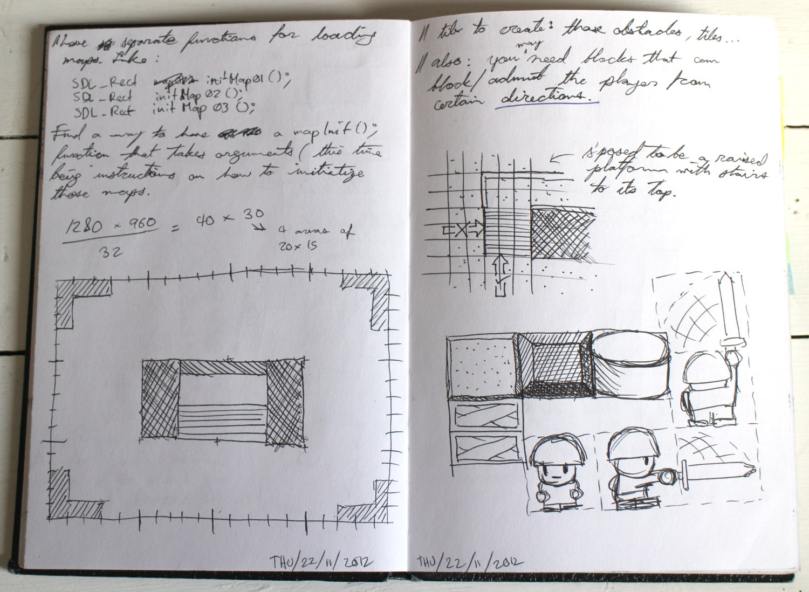
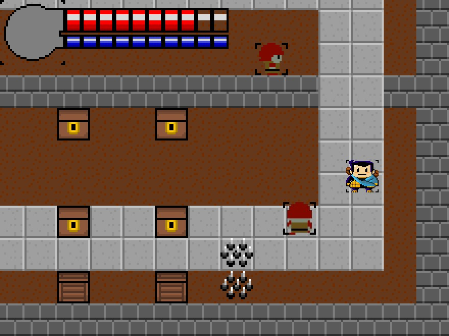
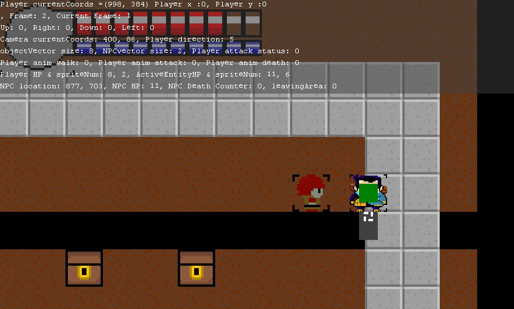
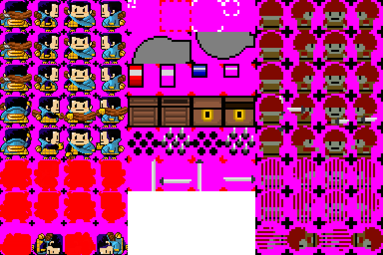

Two brothers tried to make a Zelda-esque platformer, and they caught a glimpse of development hell. Sometime around winter 2012, I used my new-found C++ skills to make a simple 2D game, like the Nintendo classics. My brother Mike offered to help with his art skills. So the BroQuest began.

## Tools used

- [SDL](https://www.libsdl.org/) as the foundation of the game's engine. This library allowed me to work with graphics and keyboard controls using C++.

## Overview

The game had to blend together:

- **User control**. This thing has to respond to inputs from the user, from the mouse and keyboard
- **In-game space**. Each entity exists in that space, and the engine will move entities and control interactions between them and the world
- **Camera system**. We want a game world that's larger than one screen.
  So we need a way to show only relevant events around the player
- **Graphics**. Each object needs graphics to be shown on the screen.
  If an object has different states, or can be seen from multiple angles, we needed more graphics for it.
  And also if we have different types of terrain

## Process

I ended up writing a game engine from scratch by walking through an SDL tutorial.
Over a few weeks, I learned how to assemble all these elements together:

1. Game engine
1. Co-ordinate/map grid system
1. Basic animation through sprites
1. Controls to let the player move and interact with world by opening things and slaying NPCs
1. Primitive AI. Yeah, all these guys did is move towards my character in a straight line and attack if I'm close enough. But they were doing these things automatically

## Results

Unfortunately, we stopped working on this when the summer ended and we just got busy with life.
I went back to school, and my brother got a bit more busy at work.

I learned how much effort it took to build a good game.
Simply building a _playable_ game feels like an achievement in itself.
All this work gave me tons of respect for serious game devs.
