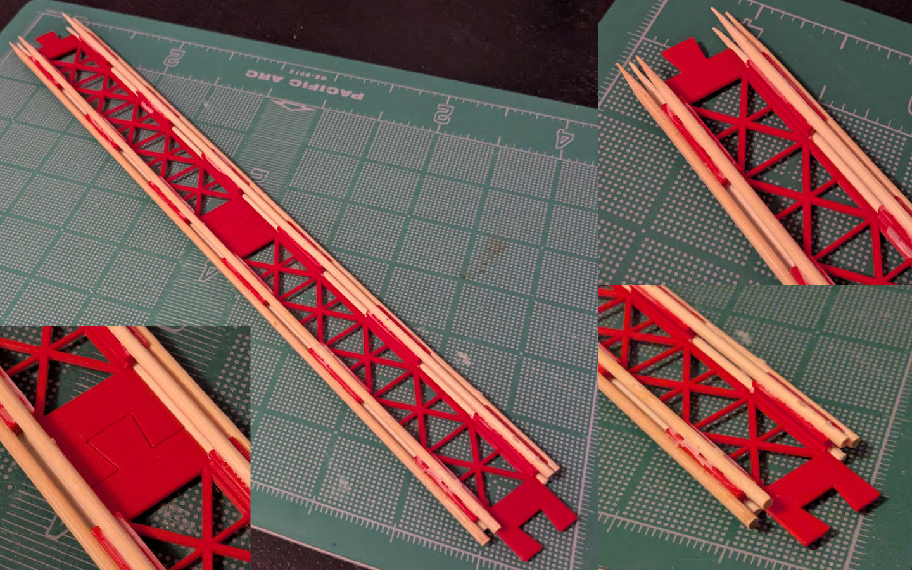
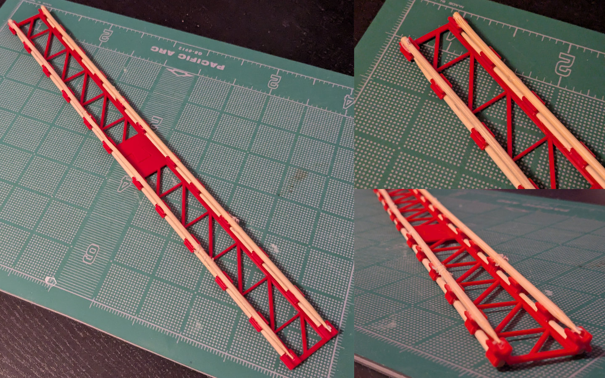
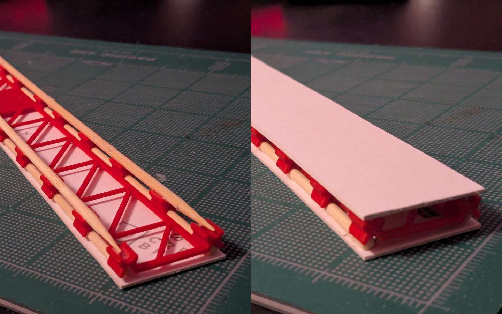
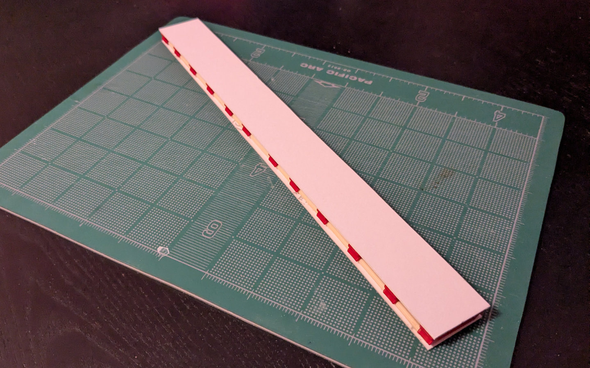
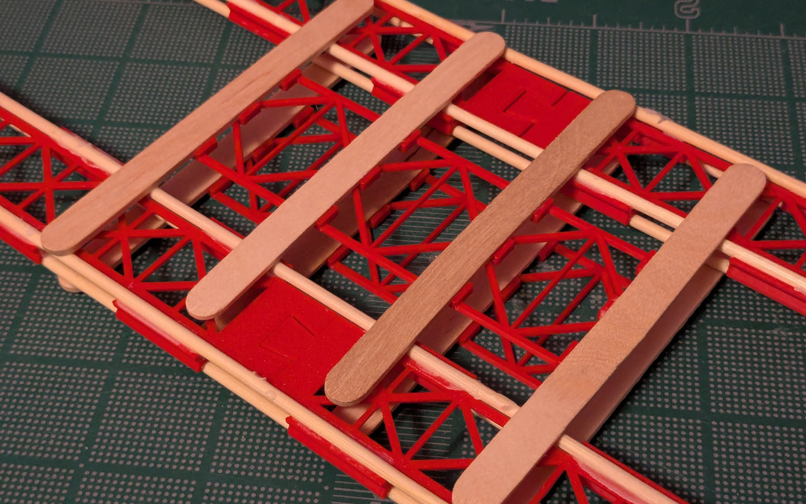
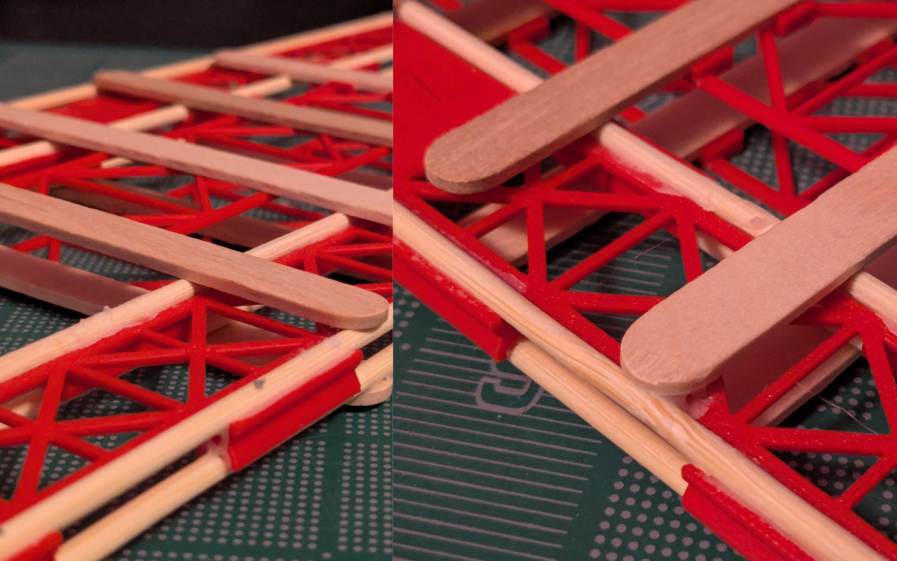

## Overview

This project became something of a test case for using code-CAD to 3D-print components for home crafting and making small furniture. The goal was to design and build useful assemblies using common materials.

## Version 1

The general design is of an open web joist consisting of a 3d-printed core and dowels (in this case, bamboo barbecue skewers). The joist core acts as a host for gluing dowels that complete the assembly.

Depending on length, the joist core can be printed in parts. And integrated together using the dovetail connections.

## Version 2

A re-written version of the dowel joist, with more control over reinforcement pattern. The default here is lighter than its predecessor.

It's a lighter component overall, with smaller dowel holders. It does warp a bit more, compared to the old one. But the lighter weight and lower resource cost is probably worth it.

## Card reinforcement

These dowel joists can be built up further using illustration board.

This assembly can probably be finished with a covering of kraft paper/tape or paper-mache.

## More complex assemblies

We're not restricted to dowels with this approach.

Similar structural members can be designed to fit flat components (like popsicle sticks)

## Next steps

The experiment has gone very well! I'm confident that continued work on `swcad-js`, (and general modelling work) will lead to cool building projects in the future.
