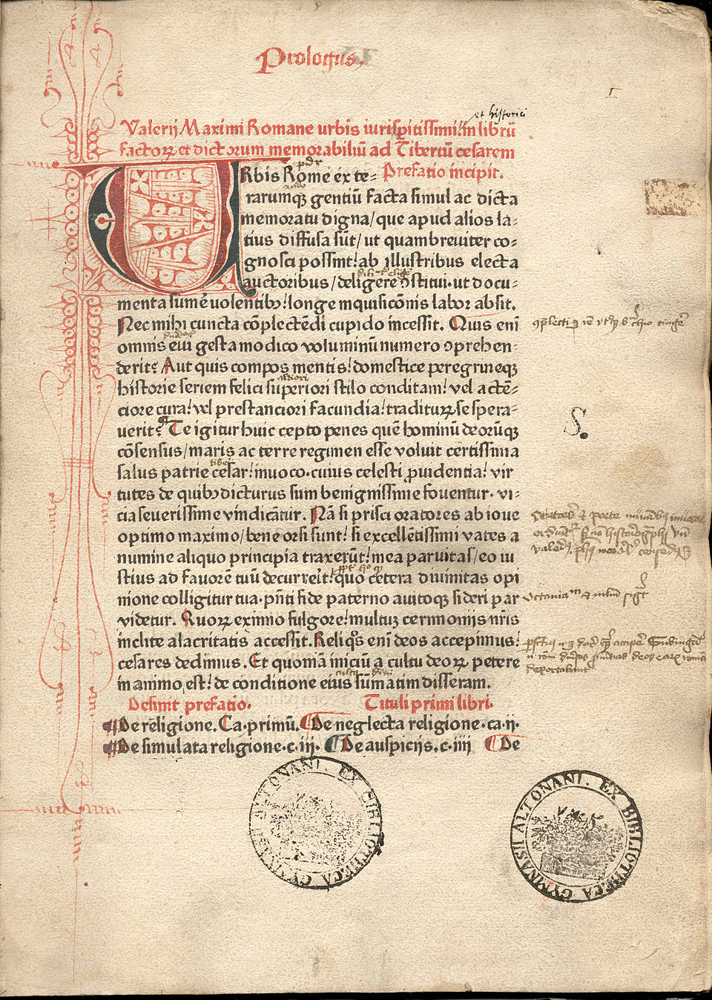
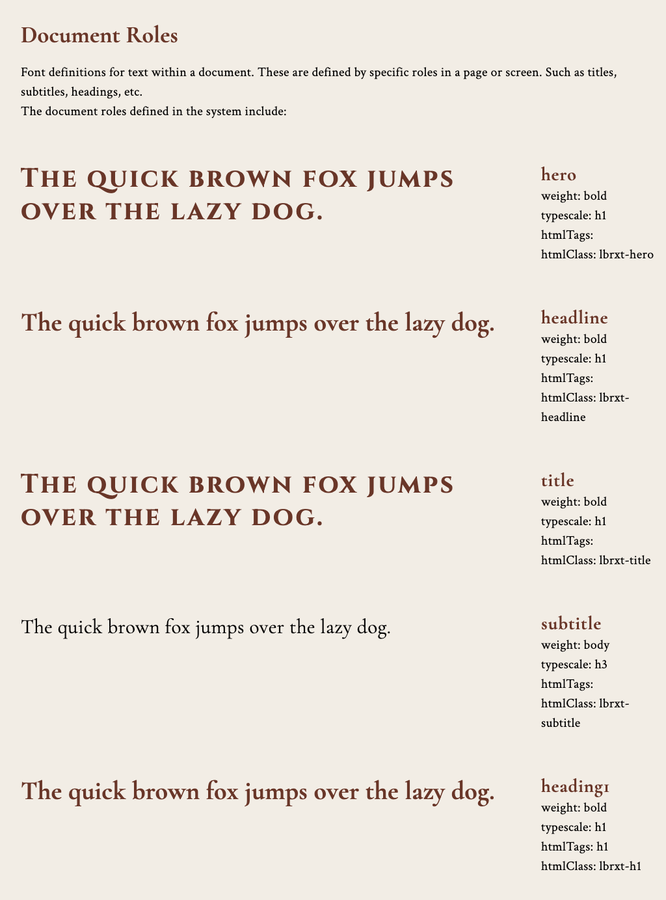
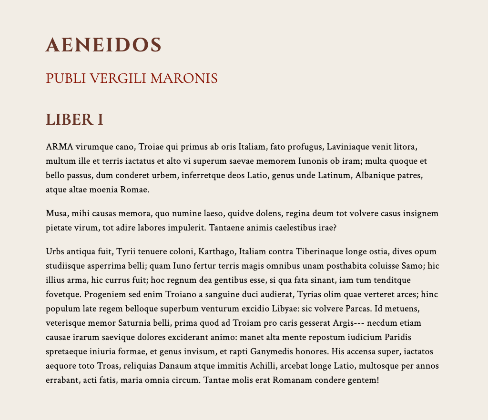
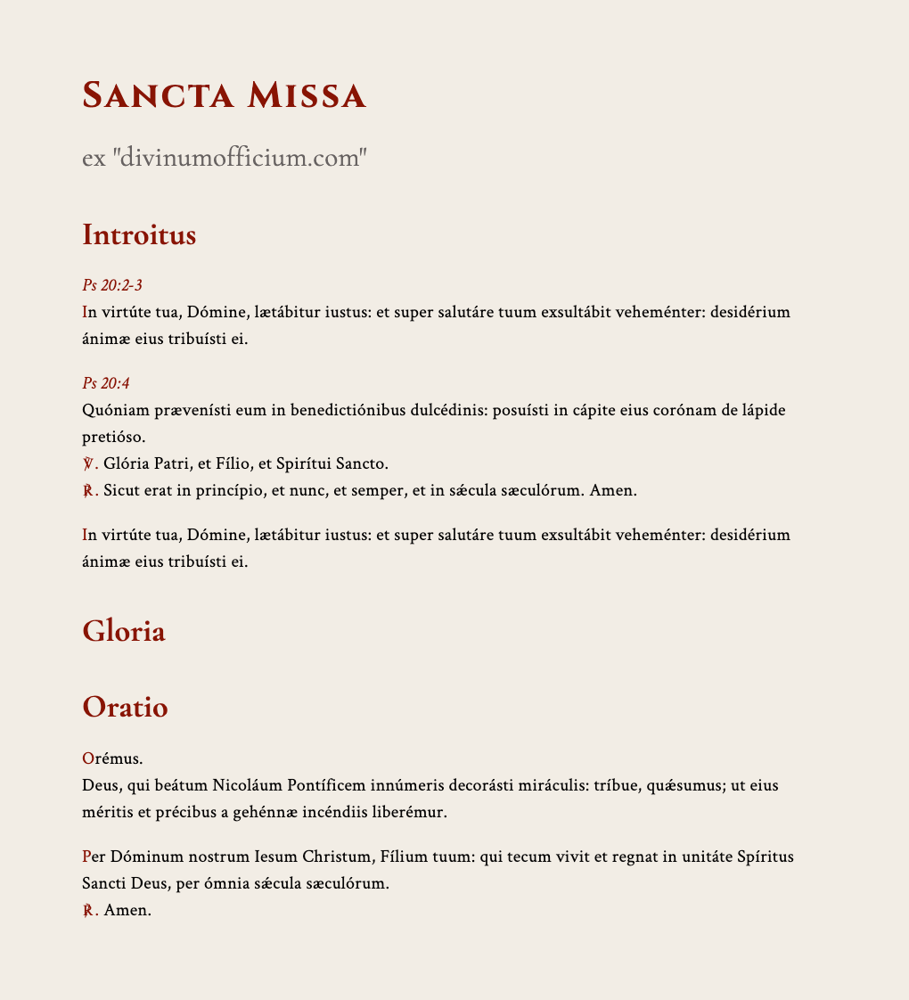
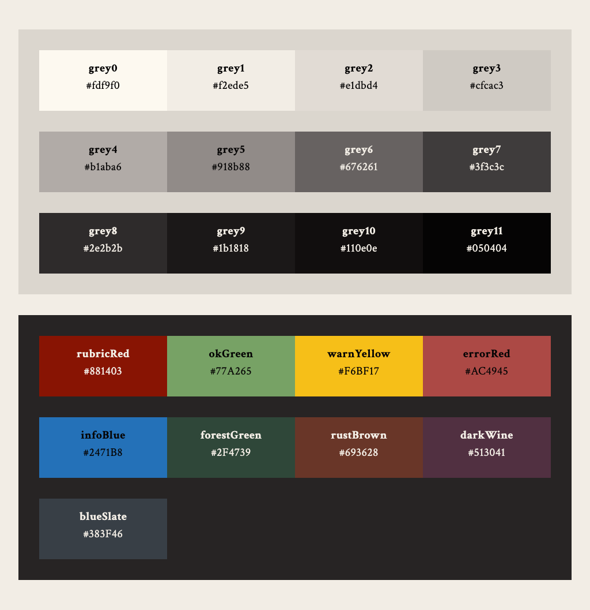
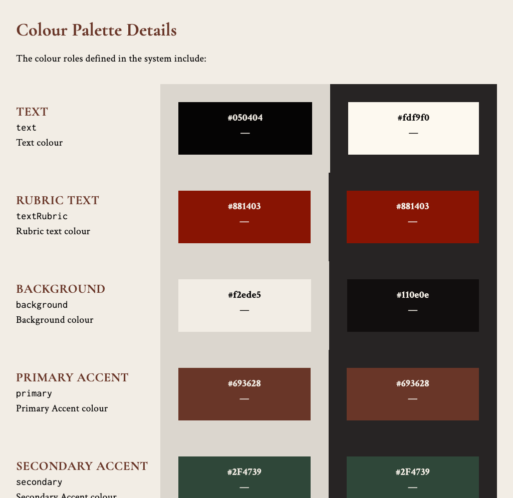
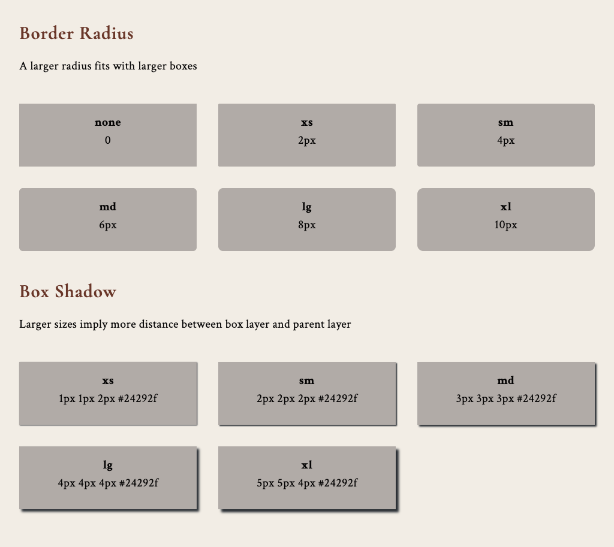

_Core technologies -- CSS, Node.js, NPM workspaces, Theme-UI_

[LibRext](https://github.com/guild-st-isidore-TO/librext) (Librarium Textuum / Library of Frameworks) is a UI design system and component library developed by the [Guild of St. Isidore (TO)](https://github.com/guild-st-isidore-TO).

LibRext is inspired primarily by printed texts during the [era of the Incunabula](https://en.wikipedia.org/wiki/Incunable), the [first century after Gutenberg's press](https://www.britannica.com/topic/incunabula) changed Europe and the world. This was a time when old manuscript production methods were giving way to the next phase of bookmaking. New processes were explored, but printmakers were not far from the era of scribes writing huge manuscripts.



## Motivations

> As a design system, LibRext aims to look consistent on Print, E-Reader, and Screen.

As a history dork, I've always had an eye for old books and printed documents. That's been intensified as I've started to learn Latin in a religious/liturgical context in the past year.

At the same time, I've gained an interest in self-publishing since my web-dev career skills are unusually useful there. Aside from the web knowledge, document creation and sharing is essentially what web development is.

E-Books are essentially packages of Markup and CSS zipped up. I had recently coded a resume building tool that used CSS to style HTML documents that could then be converted to PDF/EPUB.

This was also a time where I'm starting several group projects and long-term personal initiatives. A design system started looking like a good thing to have if I'm handling multiple design projects at once.

So the time eventually came to put it all together and give it a shot. Building a custom design system that can work consistently on screen, print, and e-books.

## Usage

LibRext v0.1.9 is available as a set of global stylesheets. Users can use the various design tokens through CSS variables:

```
.widget-set .widget {
    background-color: var(--lbrxt-col-grey4);
    width: 100%;
    margin: 2rem 0;
    text-align: center;
}
```

or HTML class names:

```
<h1 class="lbrxt-title lbrxt-col-grey9">Universal Declaration of Human Rights</h1>
```

## Typography

> LibRext has a heavy focus on old-style serif fonts, as it looks to early Renaissance printed works as inspiration.

The design system uses these six typefaces:

| TYPEFACE | USAGE / ROLE |
| --- | --- |
| Crimson Text | Typical serif body, usable as alternate heading |
| Cormorant Garamond | Ideal serif heading |
| Cinzel | Titles, display (serif) |
| Open Sans | Typical sans-serif body |
| Lato | Alternate sans-serif body |
| Inconsolata | Typical monospace |

### Document Roles

The LibRext system organizes text styles into Document Roles.



### Text Examples

Showing display and subtitle styles, dark headings.


Using different coloured headings.



Liturgical text, showing rubric colour



## Colours

> As a classicist design system, LibRext looks to old-school naturalistic hues for inspiration. The palettes were chosen to approximate colours that could’ve been available to scribes and publishers in previous centuries

At this point, most of the colours are finalized (except the "indicator" colours). The shades of grey were chosen to have a bit of organic warmth, even when rendered digitally.



Much like in the text, colours are organized into roles.



## Shapes

> As for shapes, LibRext deals only with boxes. There are several options available for border radius, box shadow, widget heights, and card styles

Starting off with a few small presets for now. More comprehensive card and surface presets should follow soon.



## More Info

The design system's repo is at:   
[https://github.com/guild-st-isidore-TO/librext](https://github.com/guild-st-isidore-TO/librext)

For more info on the Guild of St. Isidore, check us out on GitHub:  
[https://github.com/guild-st-isidore-TO](https://github.com/guild-st-isidore-TO)
