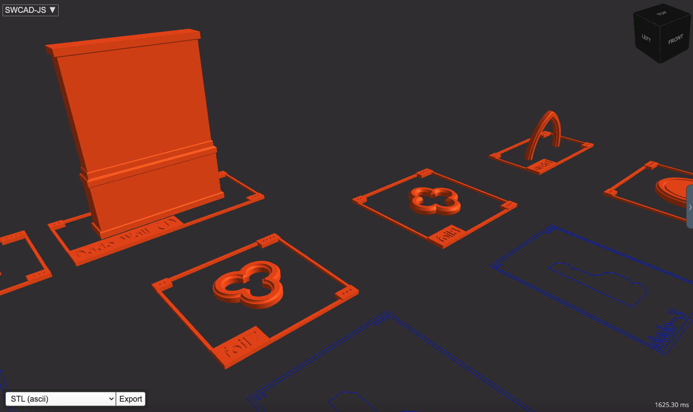
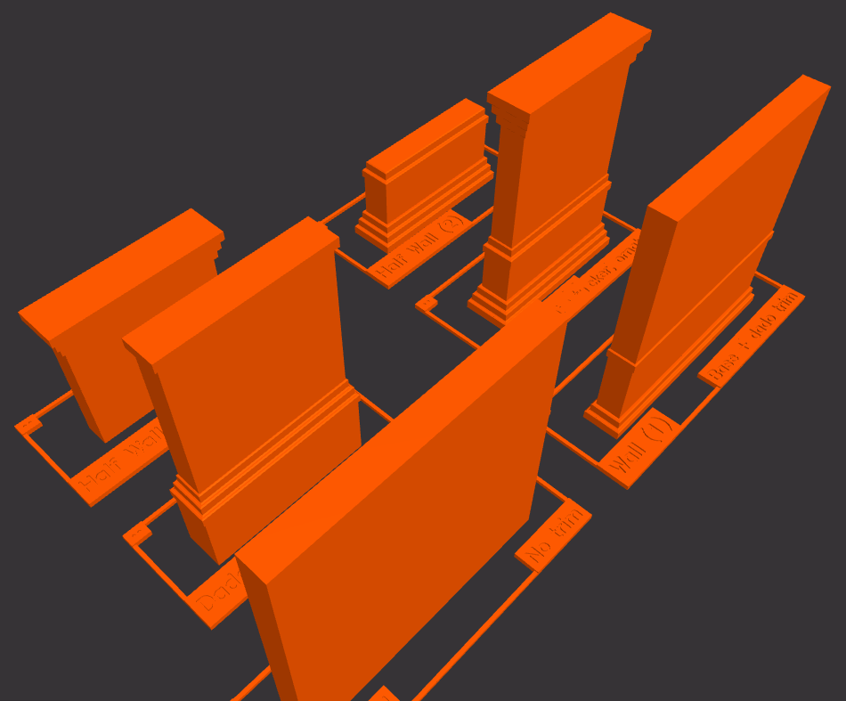
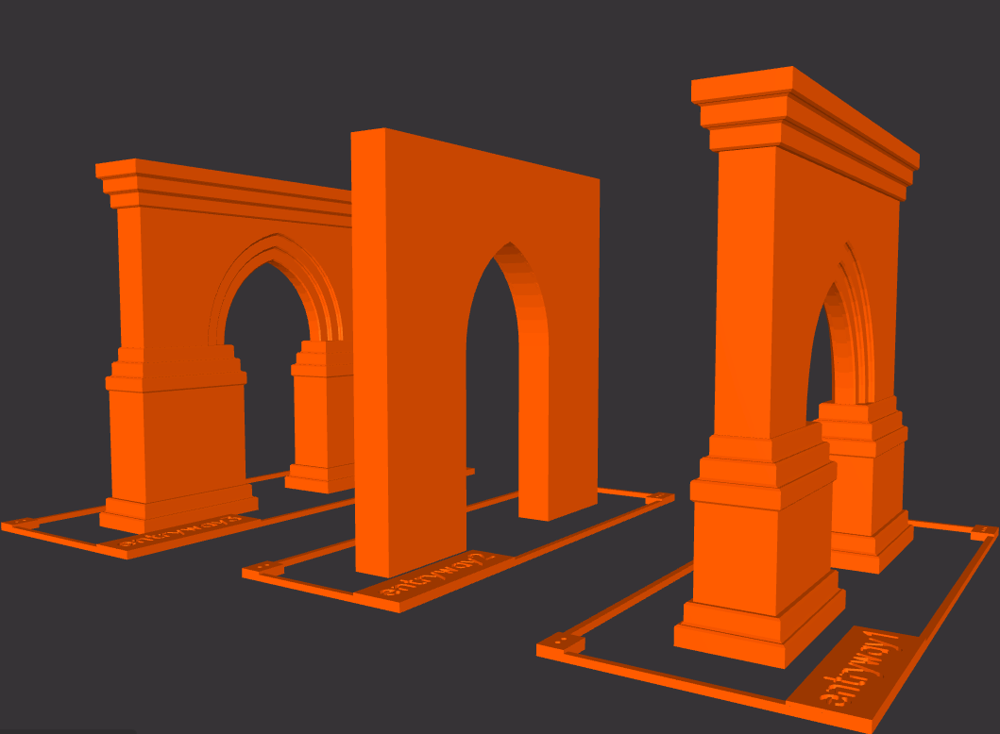
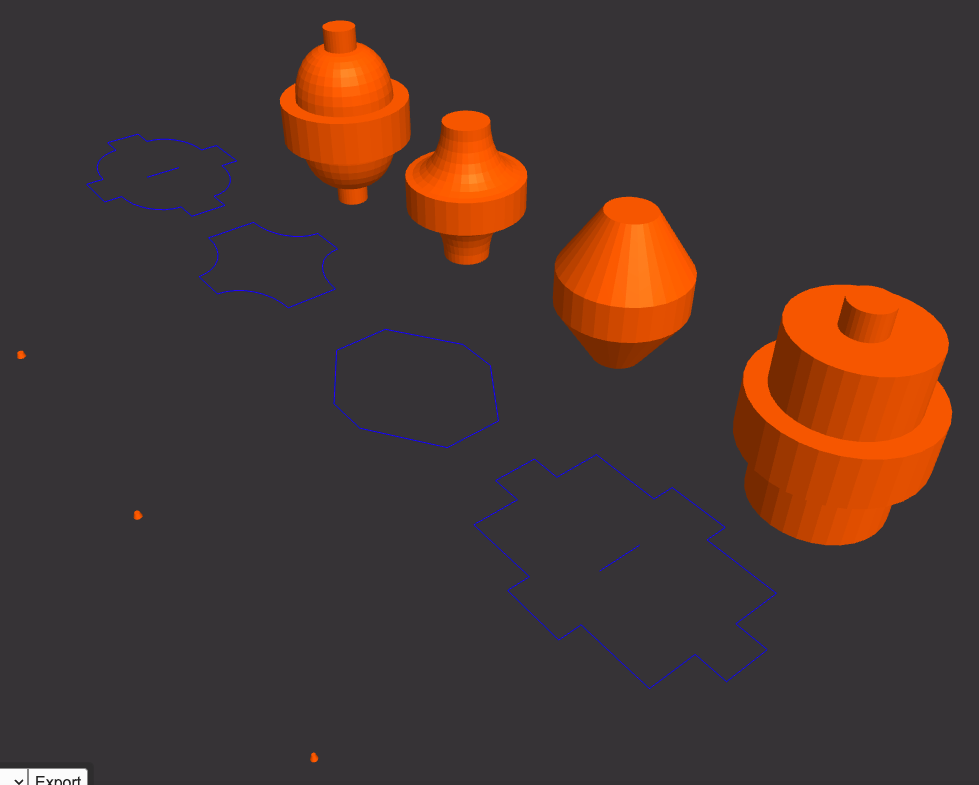
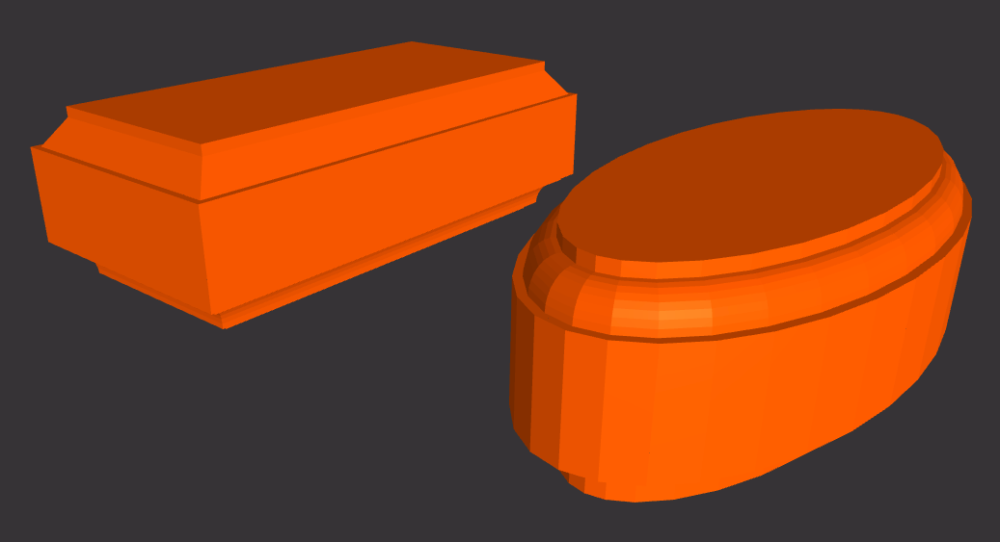
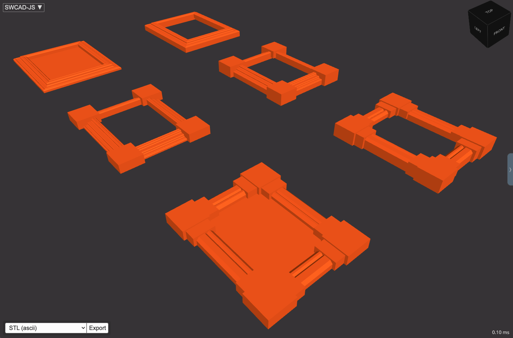

## New Beginnings

`swcad-js` is a restructured and upgraded version of [`sw-jscad`](/portfolio/sw-jscad/). The older package's functionality was reworked in to a new API for a more coherent and usable developer experience. After that, a new layer of functionality was added into the library from my modelling repo. The internal structures were cleaned up and gradually moved towards a stable module standard.

See the library in action here: [sw-jscad-viewer.netlify.app](https://sw-jscad-viewer.netlify.app/)   
Check out the codebase: [github.com/salvador-workshop/swcad-js](https://github.com/salvador-workshop/swcad-js/)  



With this many changes compared to its starting point, I felt it was natural to rename the project as well. It's admittedly confusing, but I'll eventually create more `swcad` tools in other languages/platforms. So `swcad-js` made sense to me.



## Rationale

Why write and use `swcad-js`?

`jscad` and `sw-jscad` have already made it possible for me to design precise models with my web developer skills (see ["3D-printed Dowel Components"](/portfolio/dowel-components-1/)). More investment in time/resources feels like a solid bet, in terms of code-CAD benefits.

`jscad` is in active development, and setting up an open-source library allows me to leverage the JSCAD ecosystem's tooling, plus the JS + Node ecosystems as well.

Free web-based tooling enables some of what corporate software houses have been promising (_powerful precise applications without installs_), without the drawbacks to access (_heavy DRM, connectivity failures_). This gives code-CAD toolmakers a degree of digital self-sufficiency that insulates from enshittification of proprietary tools.



## Notable changes and additions

The old multi-step initialization was pretty lame:

```javascript
const swJscad = require('sw-jscad').init({ lib: jscad });
const swjUi = require('sw-jscad-ui').init({ lib: jscad, swLib: swJscad });
const swjFamilies = require('sw-jscad-families').init({ lib: jscad, swLib: swJscad });
const swjBuilders = require('sw-jscad-builders').init({ lib: jscad, swLib: swJscad, swFamilies: swjFamilies });
```

And has been replaced with a single-line init:

```javascript
const swcadJs = require('swcad-js').init({ jscad });
```

The old library used separate modules as well, and they've been consolidated into a monorepo for easier development overall. The new library also features a consistent internal module structure (only `jscad` and `swcadJs` for all functions and modules).

```javascript
const moduleInit = ({ jscad, swcadJs }) => {
  // ...

  const model = (opts) => {
    // ...
    return [mainModel, modelParts, modelProperties]
  }
  
  return model
}

module.exports = {
  init: moduleInit
}
```

The new structure is already leading to more consistent code reuse. Keeping things organized is also leading to faster development. This newfound velocity led to these components:

### Open Web Joist

These joists can be useful for any lightweight frame, and the web reinforcement patterns can be customized.


### Router Bits, Routed Solids

Useful for decorative components, with both 2D and 3D options.






### Trim Family Frame

This rectangular frame model leverages trim families defined in the `swcad-js` system.



## Next Steps

- 2D/3D model analysis (for test cases and other metrics)
- More refinement, standardization for older functions
- More complex structural modelling

## More Info

### Online viewer

[sw-jscad-viewer.netlify.app/](https://sw-jscad-viewer.netlify.app/)  

A heavily customized version of the JSCAD UI ([https://github.com/hrgdavor/jscadui](https://github.com/hrgdavor/jscadui))

### API Docs  

[salvador-workshop.github.io/swcad-js/](https://salvador-workshop.github.io/swcad-js/)  

### Repository

[github.com/salvador-workshop/swcad-js/](https://github.com/salvador-workshop/swcad-js/)  

### NPM package

[npmjs.com/package/swcad-js](https://www.npmjs.com/package/swcad-js)  